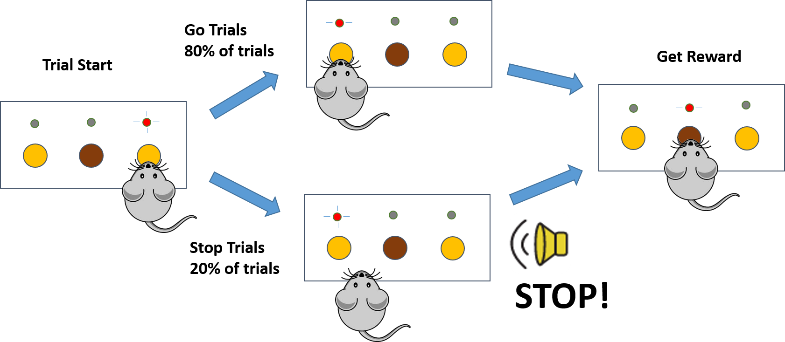

Stop Signal Task
================

This is a program for controlling the stop signal task, which is widely used in behavior inhibition reasearch.

The stop signal paradigm has been adopted for evaluating response inhibition and impulse control in many areas such as psychology, cognitive neuroscience and clinical trials for many years. `Logan et al. <http://www.psy.vanderbilt.edu/faculty/logan/>`_ proposed the horse-race model to estimate the covert latency of stop process (SSRT) in 1984, which greatly promoted the research of response inhibition since then.

This software is used for task control of rats. The task is modified from `Barak et al. 2011. <http://www.jneurosci.org/content/31/25/9254.long>`_ where details can be found.

This software was developed by Alex Zhang at the Institute of Brain Science at Fudan University.

Please send feedback to Alex Zhang (superabee@gmail.com).

Python Dependencies
---------------------------
* Python 3.4
* NumPy
* SciPy
* Matplotlib
* PyQt5
* pySerial

Arduino Uno Libraries
--------------------
* DS3232RTC
* SoftReset
* TrueRandom
* Time

0) Installation:
----------------

Download and unzip the .zip file or using git to clone the whole project:

    git clone https://github.com/superabe/sst

Then go to the sst folder and type:

    python setup.py install

This will install the python part of the program.

Open the arduino sketch with arduino IDE and upload to the Uno board.

Hardware connections are not available online at present.

1) Usage
--------
Simple GUI was supplied.
Type command:
 
    sst-gui

in commandline would fire up the user interface

Logics
------
** The training box and test procedure are as follows

** Training Procedure

Rats were deprived of water and weighted daily to maintain about 90% of their original body weight. 
On the first day, rats were allowed to explore freely in the operant chamber for 1h with all the apertures closed and LEDs OFF. Then the reward aperture was opened and the central LED was activated. When the central LED was on, 50??l water (approximately) reward would be delivered followed by the central LED off for 10s if the rats insert their snouts into the reward aperture. When the rats keep their snouts in the reward aperture to get reward, we move on to the next stage (If rats keep their snouts in the reward aperture, they would get water rewards every 10s). It approximately took 1-2h to finish this step. In this stage, left aperture was also opened with left LED on. Rat initiated trials by inserting snouts into the left aperture, which was confirmed by the left LED off and central LED on. Collection of water reward in the reward aperture would 
light the left LED on to start a new trial. Left LED would keep on until rats inserted snouts into the left aperture. Once animals completed two consecutive daily sessions of 100 trials within 30min, the right aperture was introduced. In this stage, rats learned to insert snouts into right aperture to start a trial, followed by inserting snouts into left aperture (Go Response) within a limit hold (LH) of 30s to get reward. The LH would be progressively shortened. When the rats could perform 100 trials in 30min with a LH of 5s, the stop signal was introduced. 
Stop signal was an auditory stimulus (8000Hz, ~80dB tone, 500ms long). On go trials, the rats were rewarded for inserting snouts into right aperture followed by the left aperture within LH. If the rats fail to insert snouts into left aperture at the end of LH, they would not receive reward. Stop signal was pseudo-randomly presented on 25% of total trials. Stop trials was initiated the same as the go trials, but stop signal was presented after the rats insert their snout into the right aperture. If they refrained from inserting snouts into the left aperture during the LH, water reward would be delivered. Otherwise, they would experience a timeout. Both the LH and stop signal were shortened progressively to a reasonable time.

Known Issues
------------

Thanks
------
Thanks to JiYun Peng, ShengTao Yang and all the people who devote their talent to open source software. I won't make it without their preliminary work and effort.
